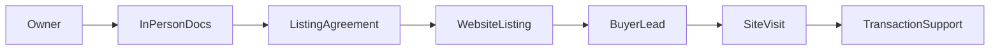

# Palakkad Real Estate Broker — Business & Website Specification

This document describes the intended business model, operating workflow, and how the public website and admin product support it. It is written for internal alignment, partner briefings, and as a source for marketing and “About” copy. It is **not** legal advice.

---

## 1. Purpose and audience

**Purpose:** Single reference for what the brokerage does, who it serves, how owner onboarding and documentation work, and how digital channels (especially this website) fit into day-to-day operations.

**Primary audiences:**

- Founders and staff running listings, site visits, and owner relationships  
- Marketing or web contributors who need accurate positioning  
- Technology maintainers mapping business promises to product features  

**Secondary use:** Excerpts may be adapted for the public About page, Services page, or footer—after review for tone and compliance.

---

## 2. Geographic scope

**Focus: Palakkad district, Kerala only.**

The brokerage intentionally concentrates on one geography to:

- Build deep local knowledge of neighborhoods, pricing, and development patterns  
- Visit properties and owners without diluting effort across unrelated markets  
- Market the website and brand to buyers and investors who are **actively looking for land, plots, and homes in Palakkad**  
- Present a curated inventory rather than a nationwide aggregator  

Listings and marketing messaging should consistently signal **Palakkad-first** (towns, villages, and corridors within the district). Expansion to adjacent areas, if any, should be a deliberate business decision reflected in copy and filters—not an accidental drift.

---

## 3. Business model (broker, not a passive listing portal)

This operation is a **real estate brokerage** that:

1. **Identifies and engages property owners** (land, plots, residential) who wish to sell or, if offered, lease.  
2. **Aligns on representation** through clear, written arrangements (e.g. marketing authority, brokerage terms, duration, exclusivity where applicable). The exact legal form—agreement to sell, brokerage agreement, or other instrument under Indian law—must be drafted or reviewed by **a qualified advocate** familiar with Kerala property practice. This document does not prescribe clause wording.  
3. **Obtains the practical rights needed to market and facilitate transactions**: typically the right to advertise the property, show it to prospects, coordinate inquiries, and support negotiation up to the point where lawyers and registrars handle conveyancing.  
4. **Lists approved inventory on this website** and promotes it through digital and local channels.  
5. **Serves buyers and serious tenants** who discover listings and submit inquiries, guiding them through viewings and next steps in line with brokerage standards.

The website is a **shop window and lead engine**, not a substitute for in-person verification, signed mandates, or legal due diligence.

---

## 4. Property focus

| Priority | Types | Notes |
|----------|--------|--------|
| **Primary** | **Plots and land** | Core audience: buyers seeking build-ready or investment land in Palakkad. |
| **Primary** | **Residential homes** | Houses, villas, apartments where the brokerage has owner mandate. |
| **Secondary** | **Rentals** | The product supports `rent` listings and contact interest “Renting a property.” Operational emphasis on rentals should be stated explicitly in marketing if it is a real service line; otherwise keep inventory and copy sale-focused. |

Categories in the admin (e.g. plot vs house) should mirror how the business segments inventory for buyers.

---

## 5. Owner journey (operational)

End-to-end flow from first contact to live listing:

1. **Lead / outreach** — Owner referral, inbound call, walk-in, or outbound contact.  
2. **Initial discussion** — Requirements, timeline, asking price band, property type and location within Palakkad.  
3. **On-site visit** — Physical inspection; boundary and access notes; photo plan.  
4. **In-person document collection** — The brokerage meets owners **in person** to collect and review paperwork. Digital uploads alone are not the primary path for mandate properties; originals or certified copies are handled according to internal policy and advocate guidance.  
5. **Document checklist (generic; not legal advice)** — Typical items to *discuss with counsel* may include:  
   - Title deed / sale deed chain and linked documents  
   - Encumbrance certificate (and updates as relevant)  
   - Tax receipts, possession proof, partition deeds if applicable  
   - Identity of owners; marriage / succession context if relevant  
   - Power of attorney, if an agent represents the owner  
   - Any approvals (e.g. conversion, layout, building permit) depending on asset type  
6. **Verification stance** — Internal review and, where appropriate, referral to an advocate for title opinion before heavy marketing spend.  
7. **Listing agreement** — Signed understanding of fees, duration, marketing rights, and withdrawal terms (lawyer-reviewed).  
8. **Content production** — Measurements, facing, amenities, map link, professional or standardized photos, accurate description.  
9. **Publication** — Admin creates/updates the listing on the website (`properties` in the database); status kept current (`active`, `sold`, `rented`, `draft` as applicable).  

**Website expectation:** Prospective sellers should be told clearly that **listing starts with a conversation and an in-person meeting to collect documents and agree on marketing rights**—not only an online form.

---

## 6. Buyer journey

1. **Discovery** — Search, social, referral, or local ads pointing to the website.  
2. **Browse** — `/properties` with filters (sale/rent, category, location fields such as city/locality within Palakkad).  
3. **Shortlist** — Compare listings; use maps and descriptions.  
4. **Inquiry** — Contact form, phone, or WhatsApp; interest tagged as buy (or rent). Stored as **leads** (`source: website` where applicable).  
5. **Response** — Staff qualifies the lead, shares additional details subject to owner consent, schedules site visits.  
6. **Site visit** — Physical showing; negotiation support within brokerage remit.  
7. **Transaction** — Introduction or handoff to **banking, legal, and registration** professionals; brokerage does not replace advocates or lenders.

---

## 7. Website role (product alignment)

| Function | How the product supports it |
|----------|-----------------------------|
| Showcase inventory | Public property listing pages fed from Supabase `properties`; sale/rent, media, address, map embed. |
| Trust and positioning | About, Services, How it works, testimonials-style sections—copy should be updated to Palakkad and broker-led verification (see implementation note below). |
| Capture seller intent | Navbar “For sellers” → Contact; Services page; microcopy inviting owners to list (see Section 9). |
| Capture buyer intent | Contact form interest “Buying a property”; optional property-specific inquiries if extended later. |
| Operations | Admin: properties, categories, amenities, leads, dashboard, reports ([`docs/DATABASE.md`](./DATABASE.md)). |

### Implementation note (live site vs this spec)

Public constants and copy live in [`lib/constants/site.ts`](../lib/constants/site.ts) (`SITE_NAME`, `ABOUT`, `CONTACT`, `ASK_LEON`, etc.) and in page-level components. **As of this writing, placeholders may still reflect a generic or non-Palakkad brand.** This specification describes **target** positioning. Updating the live site to match should be a deliberate pass on `site.ts`, metadata in `app/(public)/`, and hardcoded fragments (e.g. contact page map/address) so a single source of truth is maintained.

---

## 8. Marketing and positioning

**Core message:** Trusted Palakkad brokerage—plots, land, and homes—with **owner mandates**, **in-person documentation**, and **focused local marketing**.

**Suggested themes:**

- Local expertise in Palakkad micro-markets  
- Serious buyers matched to verified, broker-represented listings  
- Clear path for owners: “We meet you, collect documents, agree terms, then list and market”  

**SEO and discovery (examples, refine with data):**

- Palakkad plots for sale, land for sale Palakkad, residential property Palakkad, house for sale Palakkad, real estate broker Palakkad  

**Channels:**

- Website SEO and structured listings  
- WhatsApp and phone CTAs (`CONTACT.whatsappUrl`, phone in [`site.ts`](../lib/constants/site.ts))  
- Google Business Profile, Instagram/Facebook for locality and new listings  
- Optional paid search/social geo-targeted to Kerala / Palakkad  

**Trust:** Emphasize process (in-person docs, written mandates, advocate involvement where stated)—not unverifiable volume claims unless data-backed.

---

## 9. Ready-to-paste website microcopy

Use or adapt the blocks below after brand and legal review.

### Hero / home (short)

**Headline option A:**  
Find plots and homes in Palakkad—with a broker who meets owners in person.

**Headline option B:**  
Palakkad land and residential listings, represented and marketed by your local brokerage.

**Subline:**  
We work directly with property owners, collect documents in person, and list mandates on this site for buyers who are actively searching in the district.

**Primary CTA:** Browse properties  
**Secondary CTA:** List your property

---

### “For property owners” band (home or services)

**Title:** List with us — Palakkad only  
**Body:**  
Interested in listing your property? **Contact us.** We meet owners in person to collect documents, confirm details, and agree on marketing and brokerage terms before your plot or home goes live on our website. We focus exclusively on Palakkad so we can visit sites, answer buyer questions accurately, and market where it matters.

**Button:** Start a listing conversation → `/contact`

---

### Contact page intro

**Title:** Buying, selling, or exploring a listing?  
**Body:**  
Whether you are looking for a plot or home in Palakkad, or you own property here and want it listed, we are here to help. **Sellers:** we typically begin with a call or message, then schedule an **in-person meeting** to collect documents and discuss representation. Use the form below or reach us by phone or WhatsApp.

---

### Footer one-liner

Palakkad-focused real estate brokerage — plots, land, and homes. Owners: contact us to list; we meet in person to collect documents and marketing mandates.

---

### Navbar / mega-menu hint (sellers)

Replace generic “Reach serious buyers” with:  
**“List your property”** — *We meet owners in Palakkad in person to collect documents and agree marketing rights.*

---

### Malayalam-English CTA snippets (optional)

- *Palakkad-ilulla plot / veedu vitharikkan ano?* — Contact us for listing.  
- *Listing interest undel dayavayi samparkikkan* — “If interested in listing, please contact us.”  

Use alongside English for clarity on the primary site language.

---

## 10. Disclaimers

- This document is for **business and product alignment** only. It is **not** legal, tax, or investment advice.  
- **Title verification, sale deeds, registration, stamp duty, and brokerage agreements** in India should be handled with **qualified advocates** and compliant documentation.  
- The website displays information supplied under owner mandates; users must conduct their own due diligence and professional verification before transacting.  
- Rental and investment claims in marketing must match actual services and regulatory obligations applicable in Kerala.

---

## 11. Appendix: Alignment checklist (business ↔ product)

- [ ] **Geography:** Listing fields (`city`, `state`, `address`) and filters consistently reflect Palakkad-centric inventory.  
- [ ] **Sale vs rent:** Business priority reflected in featured categories and homepage emphasis.  
- [ ] **Seller path:** “List your property” and Services copy mention **in-person document collection** and **contact** as the first step.  
- [ ] **Leads:** Contact form “Selling a property” flows to admin **leads** with `source: website` for follow-up.  
- [ ] **Categories:** Admin categories include plot/land vs residential (and others as needed).  
- [ ] **Contact truth:** `SITE_NAME`, `CONTACT`, map embed, and phone/email in [`site.ts`](../lib/constants/site.ts) and the contact page at `app/(public)/contact/page.tsx` match real Palakkad office / channels.  
- [ ] **Metadata:** `title` / `description` on `page.tsx` files mention Palakkad where appropriate for SEO.  
- [ ] **Post-sale status:** Sold/rented listings updated in admin so the public catalog stays credible.

---

## Operational flow (diagram)

**Reading the flow:** The website listing sits **after** in-person documentation and a formal listing agreement. Buyer interest feeds leads, then site visits, then professional transaction support—not the other way around.

---

*Document version: 1.0 — aligns with repository structure as of the Palakkad broker spec initiative.*
